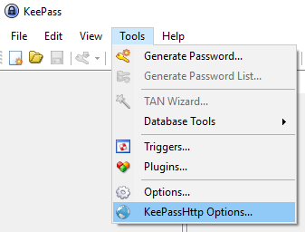

1. Download [KeePassHttp](https://raw.github.com/pfn/keepasshttp/master/KeePassHttp.plgx)

2. Place the file in the KeePass installation directory

   1. For Windows users this would most likely be: `C:\Program Files (x86)\KeePass Password Safe 2`
   2. For Linux users this would most likely be: `/usr/lib/keepass2`

3. (Re)start KeePass

4. You should now be able to find the KeePassHttp options under the `Tools` menu:

   

   ​