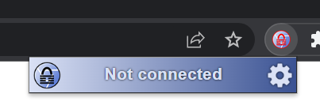

# ChromeKeePass

> Setup instructions below (or see [https://youtu.be/0cVEjYQXrHc](https://youtu.be/0cVEjYQXrHc))

ChromeKeePass is an open source Chrome extension to automatically entering credentials into websites.

The extension depends on [KeePassHttp](https://github.com/pfn/keepasshttp), using this KeePass plugin we're able te create a secure communication between the browserextension and KeePass.

The goal of this project is to create a userfriendly KeePass integration. With an easily readable and understandable sourcecode.

## Features

- Automatically entering credentials from KeePass into your browser
- Autocomplete while typing in the username field
- More to come

## Setup

1. Make sure you have KeePassHttp installed. Instruction on [how to install](Documents/Manuals/KeePassHttp%20installation.md) KeePassHttp.

2. Make sure KeePass is running and a password database is opened

3. Click the ChromeKeePass icon next to the addressbar, it'll show 'Disconnected', click the gear to go to the options

   

4. The ChromeKeePass options open, click the `Connect` button

   

5. A KeePass dialog will open, enter a desired name and click `Save`

   

6. The ChromeKeePass options dialog will now show it is connected

   

7. The encryption key (for secure communication between KeePass en ChromeKeePass) is stored inside your KeePass database under the entry 'KeePassHttp Settings'

## Build instuctions

You can find [build instuction is this document](Documents/Manuals/Buildinstructions.md).
