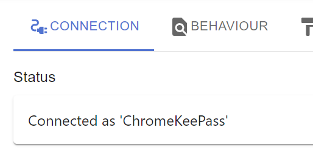

# ChromeKeePass / EdgeKeePass

> Setup instructions below (or see [https://youtu.be/0cVEjYQXrHc](https://youtu.be/0cVEjYQXrHc)) (NOTE! This shows an old version of the extension)

ChromeKeePass/EdgeKeePass is an open source Chrome extension to automatically entering credentials into websites.

To use this extension you **need to have KeePass installed** and the [KeePassHttp](https://github.com/pfn/keepasshttp) plugin, using this KeePass plugin we're able to create secure communication between the browser and KeePass.

## Setup

1. Make sure you have KeePassHttp installed. Instruction on [how to install](Documents/Manuals/KeePassHttp%20installation.md) KeePassHttp.

2. Make sure KeePass is running, and a password database is opened

3. Click the extension's icon next to the address bar, it'll show 'Disconnected', click the gear to go to the options

   

4. The options window opens, click the `Connect` button

   

5. A KeePass dialog will open, enter a desired name and click `Save`

   

6. The options dialog will now show it is connected

   

7. The encryption key (for secure communication between KeePass and the browser) is stored inside your KeePass database under the entry 'KeePassHttp Settings'

## Contribute to ChromeKeePass

- When contributing, always base you changes on the `dev-v2` branch. Pull requests will also be merged into the `dev-v2` branch
- Try to keep the coding style as consistant as possible
- You can find build instructions [over here](Documents/Manuals/Buildinstructions.md)

## Donate

I'm creating this in my spare time. If you like it, please consider a small donation.
It's very much appreciated.

